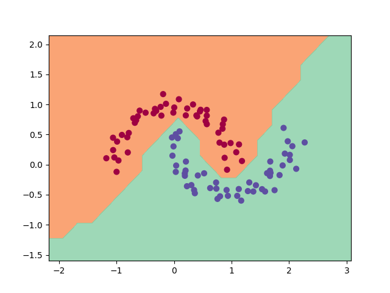
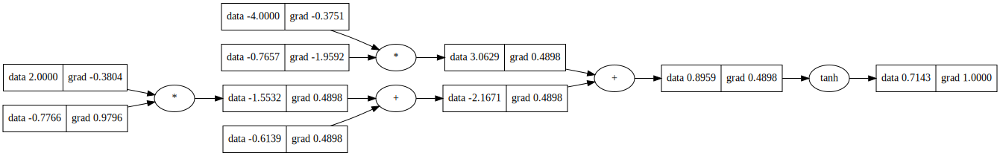

# micrograd
An automatic differentiation implementation. Implements backpropagation (reverse mode auto-diff) with a dynamically created computational graph, similar implementation to Pytorch's API. A simple neural net is built upon the micrograd to solve a binary classification problem, as the demo notebook shows.


# Example usage
below is an simple example showing different operations that can be done:
```python
from micrograd.engine import Value

a = Value(-4.0)
b = Value(2.0)
c = a + b
d = a * b + b**3
c += c + 1
c += 1 + c + (-a)
d += d * 2 + (b + a).relu()
d += 3 * d + (b - a).relu()
e = c - d
f = e**2
g = f / 2.0
g += 10.0 / f
print(f'{g.data:.4f}') # prints 24.7041, the outcome of this forward pass
g.backward()
print(f'{a.grad:.4f}') # prints 138.8338, i.e. the numerical value of dg/da
print(f'{b.grad:.4f}') # prints 645.5773, i.e. the numerical value of dg/db
```

# Training a neural net
The notebook `demo.ipynb` provides a full demo on training a simple 2-layers neural network binary classifier. This is achieved by building a neural net upon `micrograd.nn` module, implementing a simple svm max-margin binary classification loss, optimized by gradient descent. As shown in the notebook, using a 2-layer neural net with two 16-node hidden layers we achieved the following decision boundry on the moon dataset:



# Tracing graph / visualization
The notebook `trace_graph.ipynb` produces graphviz visualization of the computational graph. E.g. below is a simple neuron taking 2-D input perfroming `w*x + b` then activating using `tanh` function. Each value node include the value(on the left part) and the gradient(on the right part):



# Running tests
To run unit test you need to install [Pytorch](https://pytorch.org/), which will be the base to validate correctness of the forward and backward pass calculations:

```
python -m pytest
```